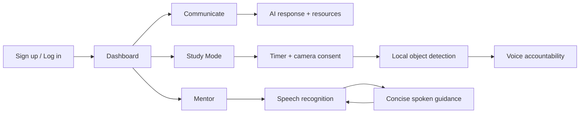

<div align="center">

# Yappers

### Your AI-powered study companion for focus, clarity, and momentum.

<a href="https://github.com/amanyatan/VEXITE-HACK-INNOVATE-yappers">
  
</a>


<br />


</div>

---

## What is Yappers?

Yappers is an AI learning companion that helps students decide what to study, stay focused while studying, and get calm, practical support when learning feels overwhelming.

It combines personalized AI guidance, voice-first conversations, timed Study Mode sessions, camera-based focus signals, and a production-ready web stack in one focused workspace.

## Why it exists

Most students do not need another pile of content. They need:

- A clear next step instead of an overwhelming roadmap.
- A study session that creates accountability.
- A mentor who explains things simply and listens naturally.
- Feedback when distraction breaks their focus.

Yappers is designed around those moments.

## Feature tour

### AI Communication

- ChatGPT-style learning conversation.
- Sarvam AI as the primary conversational provider.
- Gemini fallback when the primary provider is unavailable.
- Tavily-powered resource discovery where relevant.
- Clean source cards for useful links and references.

### Study Mode

- Setup form for subject, goal, duration, and break planning.
- Large, distraction-free countdown timer.
- Camera and microphone consent before a session starts.
- Automatic break reminders during long sessions.
- TensorFlow.js + COCO-SSD browser-side detection.
- Real-time activity labels:
  - `Studying`
  - `Using phone`
  - `Not working`
  - `Idle / away`
- Voice-only nudges when a phone or distraction is detected.
- Camera and microphone stop when the session ends.

### Mentor

- Voice-only experience with a single **Let's talk** action.
- Speech recognition → AI reasoning → spoken response → listening again.
- Concise, caring answers instead of long lectures.
- Soft female Sarvam voice configuration.
- Visible microphone permission and error feedback.

### Authentication and privacy

- Supabase email/password authentication.
- Session-aware protected routes.
- Passwords remain inside Supabase Auth and are never copied into public tables.
- Camera and microphone are requested only for the active experience that needs them.
- Study video is processed in the browser by default and is not uploaded by the local detector.

## Product flow



## Architecture

```text
Yappers/
├── Frontend/                 # Next.js App Router application
│   ├── app/                  # Landing, auth, dashboard, study, mentor routes
│   ├── components/           # Shells, layout, character, feature UI
│   ├── hooks/                # Auth and interruptible voice behavior
│   └── lib/                  # Supabase client, API constants
├── backend/                  # Express API service
│   └── src/
│       ├── routes/           # Agent, voice, study, search, coding APIs
│       ├── services/         # AI, TTS, search, coding orchestration
│       └── config/           # Environment and Supabase configuration
├── supabase/
│   ├── migrations/           # Database schema and auth profile trigger
│   └── design.md            # UI/UX design source of truth
└── render.yaml               # Render deployment blueprint
```

## Technology stack

| Layer | Technology | Purpose |
| --- | --- | --- |
| Frontend | Next.js 16, React 19, TypeScript | App Router UI and typed components |
| Styling | Tailwind CSS v4, custom design tokens | Black-first responsive interface |
| Motion | Framer Motion, CSS motion | Character states and polished interactions |
| Auth/data | Supabase | Authentication, profiles, and persistence |
| API | Node.js, Express | AI, voice, study, search, and coding routes |
| Conversation AI | Sarvam AI + Gemini fallback | Learning and mentor responses |
| Voice | Sarvam Bulbul TTS + Web Speech API | Speech-to-speech interaction |
| Search | Tavily | Current learning resources |
| Vision | TensorFlow.js + COCO-SSD | Browser-side person/phone detection |
| Hosting | Vercel + Render | Frontend and backend deployment |

## Run locally

### 1. Clone and install

```bash
git clone https://github.com/amanyatan/VEXITE-HACK-INNOVATE-yappers.git
cd VEXITE-HACK-INNOVATE-yappers

cd Frontend
npm install

cd ../backend
npm install
```

### 2. Configure environment

```bash
cd Frontend
copy .env.local.example .env.local

cd ../backend
copy .env.example .env
```

Fill the values locally. Never commit `.env` files or API keys.

### 3. Start both services

Frontend:

```bash
cd Frontend
npm run dev
```

Backend:

```bash
cd backend
npm run dev
```

Open `http://localhost:3000`. The API health check is available at `http://localhost:4000/api/health`.

## Deployment

### Vercel

Create a Vercel project with **Root Directory** set to `Frontend`.

Set:

```text
NEXT_PUBLIC_SUPABASE_URL=<Supabase project URL>
NEXT_PUBLIC_SUPABASE_PUBLISHABLE_KEY=<Supabase publishable key>
NEXT_PUBLIC_BACKEND_URL=https://<your-render-service>.onrender.com
```

`NEXT_PUBLIC_BACKEND_URL` is embedded at build time, so redeploy after changing it.

### Render

The repository includes [`render.yaml`](./render.yaml).

Manual settings:

```text
Root directory: backend
Build command: npm ci
Start command: npm start
Health check: /api/health
```

Set the provider and Supabase variables from [`backend/.env.example`](./backend/.env.example) in the Render dashboard. Set `FRONTEND_URL` to the exact Vercel origin:

```text
FRONTEND_URL=https://your-app.vercel.app
```

Deploy Render first, copy its public URL into Vercel, then redeploy Vercel. HTTPS is required for production camera, microphone, and audio behavior.

## Validation

```bash
cd Frontend
npm run lint
npm run build
```

```bash
cd backend
node --check src/server.js
```

## Environment reference

- [`Frontend/.env.local.example`](./Frontend/.env.local.example)
- [`backend/.env.example`](./backend/.env.example)
- [`render.yaml`](./render.yaml)

## Security notes

- Keep Supabase service-role and provider keys server-side only.
- Use the Supabase publishable key in the browser, never the service-role key.
- Configure CORS with the exact deployed Vercel origin.
- Do not commit `.env`, `.env.local`, or pasted credentials.
- Camera and microphone access must be clearly consented to by the user.

## License

This project is maintained for the Yappers learning experience. See the repository for the current project terms.

<div align="center">

### Plan less. Start smaller. Keep going.

</div>
